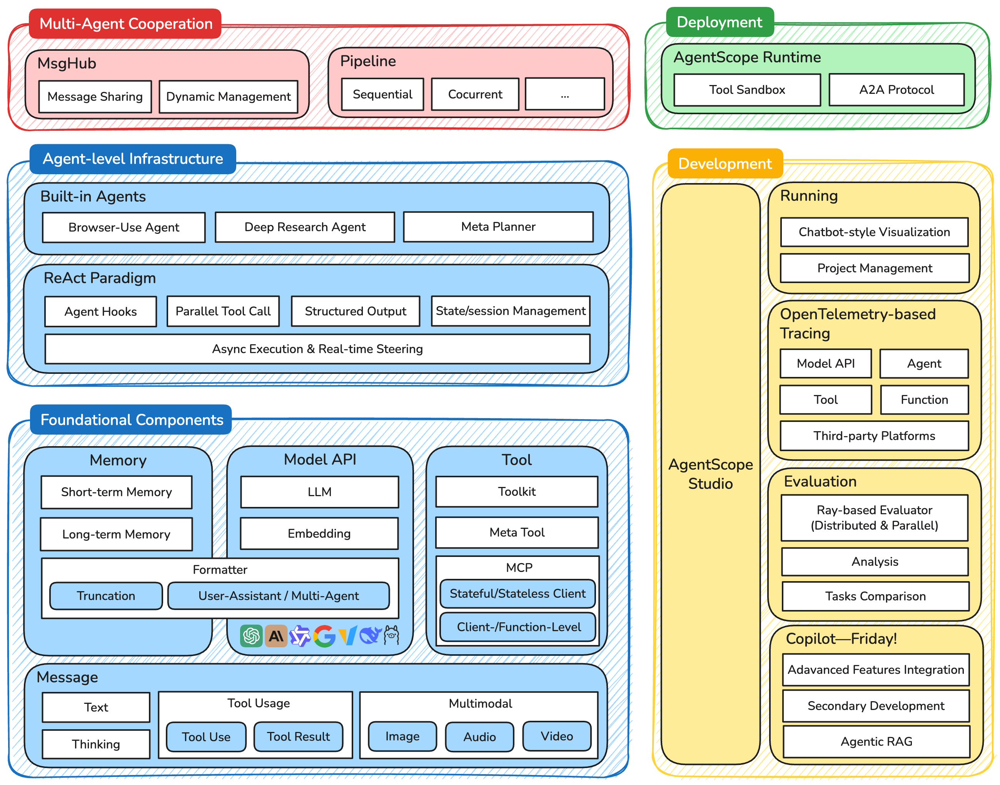
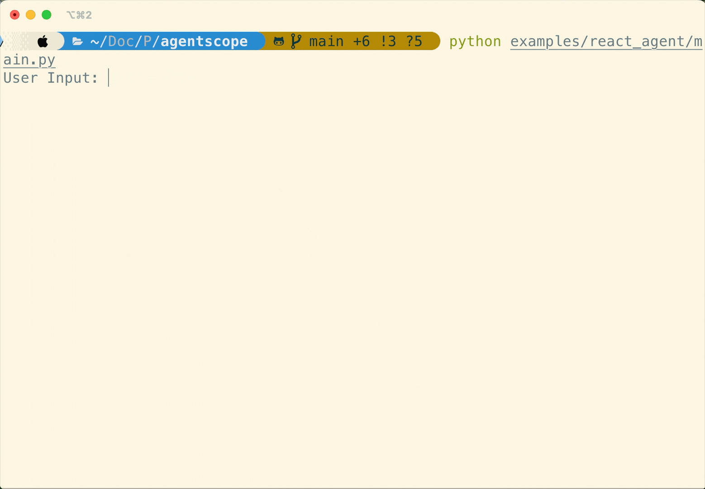
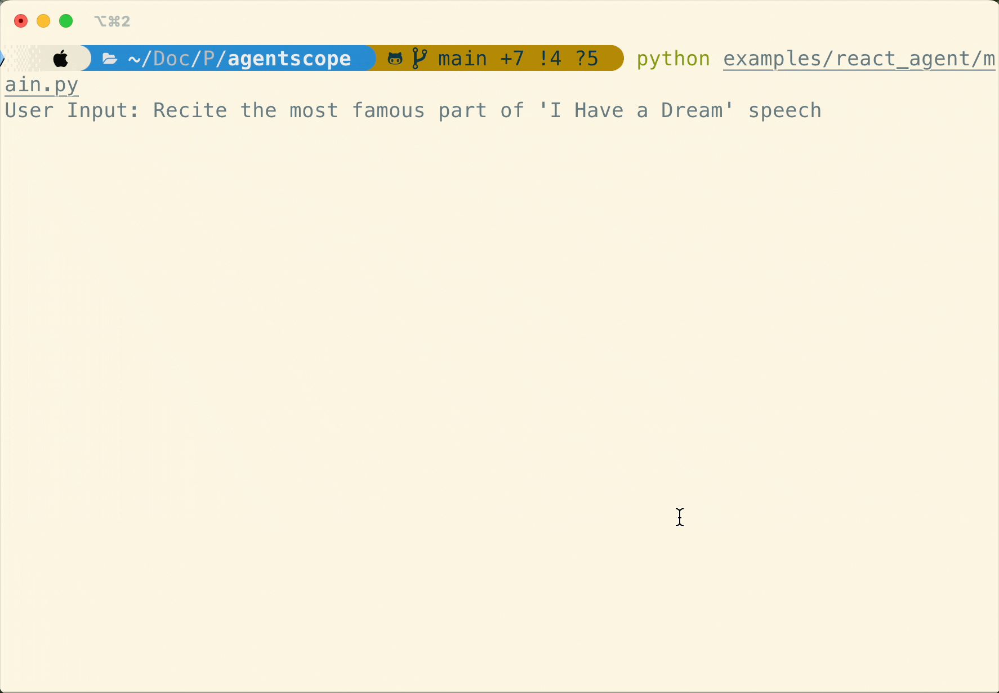
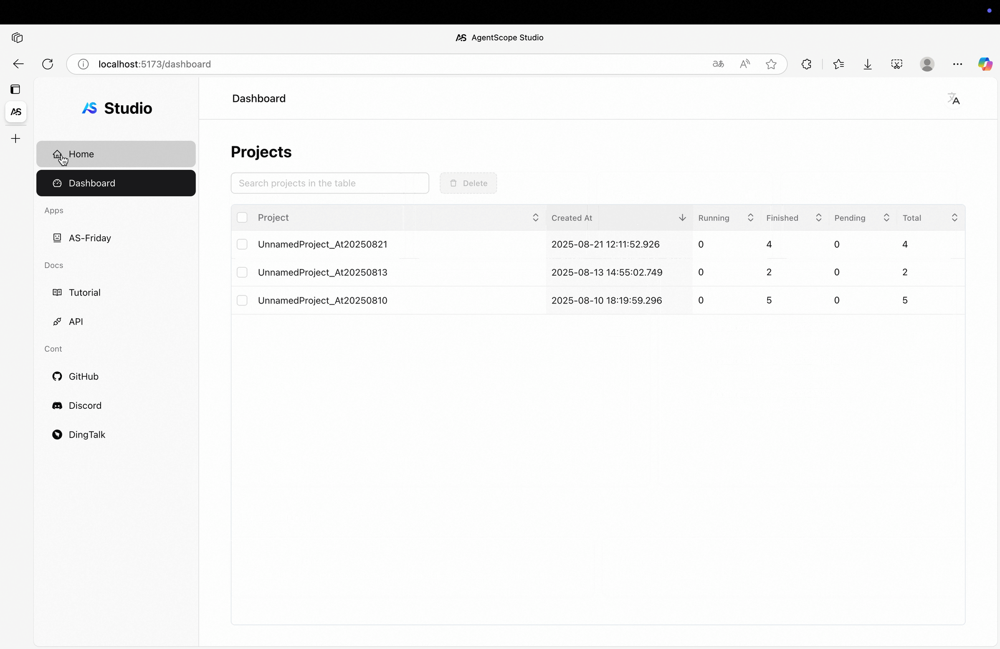
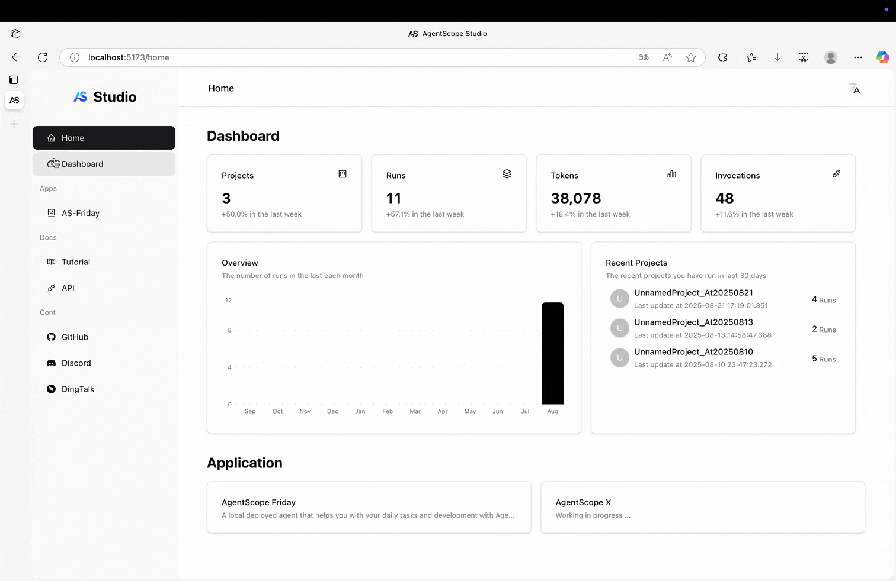
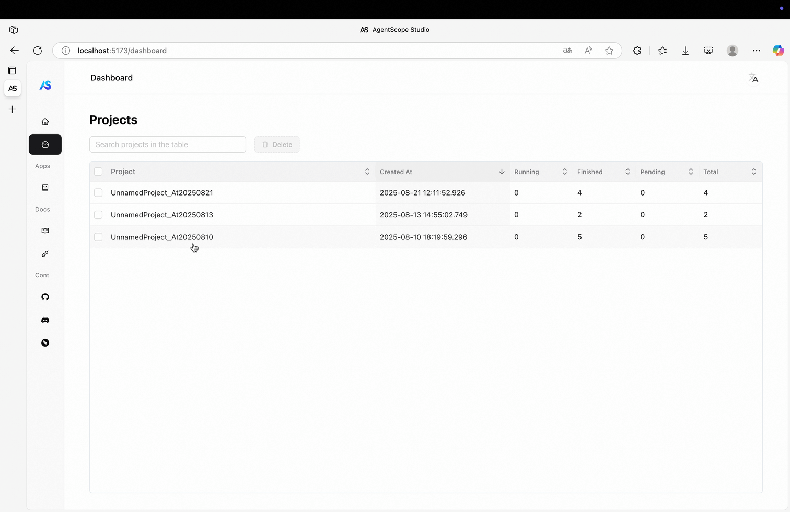
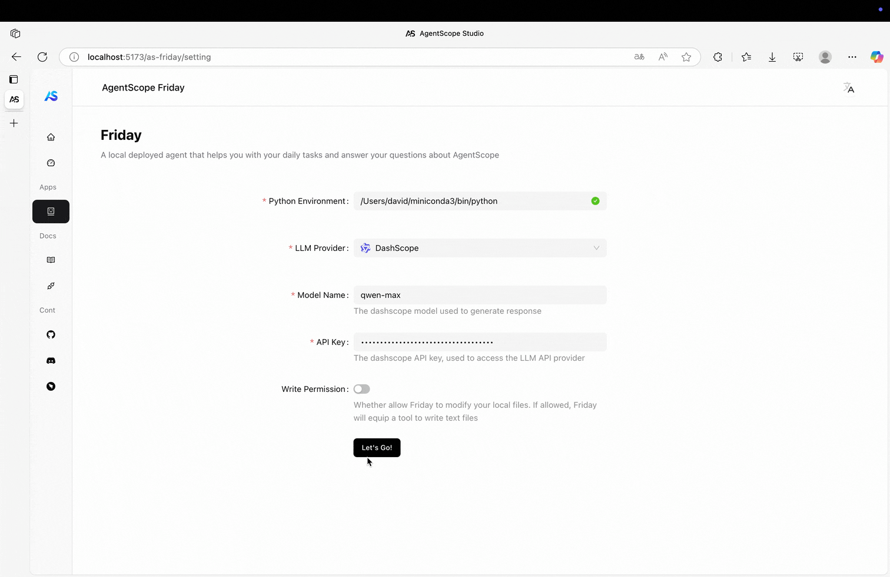

<<<<<<< HEAD
[**中文主页**](https://github.com/modelscope/agentscope/blob/main/README_ZH.md) | [**日本語のホームページ**](https://github.com/modelscope/agentscope/blob/main/README_JA.md) | [**Tutorial**](https://doc.agentscope.io/) | [**Roadmap**](https://github.com/modelscope/agentscope/blob/main/docs/ROADMAP.md) | [**FAQ**](https://doc.agentscope.io/tutorial/faq.html)
=======
[**中文主页**](https://github.com/agentscope-ai/agentscope/blob/main/README_zh.md) | [**Tutorial**](https://doc.agentscope.io/) | [**Roadmap**](https://github.com/agentscope-ai/agentscope/blob/main/docs/roadmap.md) | [**FAQ**](https://doc.agentscope.io/tutorial/faq.html)

<p align="center">
  
</p>
>>>>>>> 6ee8fa352bcaf888adf82124e0e0a5c394454506

<h2 align="center">AgentScope: Agent-Oriented Programming for Building LLM Applications</h2>

<p align="center">
    <a href="https://arxiv.org/abs/2402.14034">
        
    </a>
    <a href="https://pypi.org/project/agentscope/">
        >>>>>> 6ee8fa352bcaf888adf82124e0e0a5c394454506
            alt="pypi"
        />
    </a>
    <a href="https://pypi.org/project/agentscope/">
        
    </a>
    <a href="https://doc.agentscope.io/">
        
    </a>
    <a href="https://agentscope.io/">
        >>>>>> 6ee8fa352bcaf888adf82124e0e0a5c394454506
            alt="workstation"
        />
    </a>
    <a href="./LICENSE">
        
    </a>
</p>

<p align="center">

</p>

## ✨ Why AgentScope?

Easy for beginners, powerful for experts.

<<<<<<< HEAD
- **Transparent to Developers**: Transparent is our **FIRST principle**. Prompt engineering, API invocation, agent building, workflow orchestration, all are visible and controllable for developers. No deep encapsulation or implicit magic.
- **Model Agnostic**: Programming once, run with all models. More than **17+** LLM API providers are supported.
- **LEGO-style Agent Building**: All components are **modular** and **independent**. Use them or not, your choice.
- **Multi-Agent Oriented**: Designed for **multi-agent**, **explicit** message passing and workflow orchestration, NO deep encapsulation.
- **Native Distribution/Parallelization**: Centralized programming for distributed application, and **automatic parallelization**.
- **Highly Customizable**: Tools, prompt, agent, workflow, third-party libs & visualization, customization is encouraged everywhere.
- **Developer-friendly**: Low-code development, visual tracing & monitoring. From developing to deployment, all in one place.

## 📢 News
- **[2025-04-27]** A new 💻 AgentScope Studio is online now. Refer [here](https://doc.agentscope.io/build_tutorial/visual.html) for more details.
- **[2025-03-21]** AgentScope supports hooks functions now. Refer to our [tutorial](https://doc.agentscope.io/build_tutorial/hook.html) for more details.
- **[2025-03-19]** AgentScope supports 🔧 tools API now. Refer to our [tutorial](https://doc.agentscope.io/build_tutorial/tool.html).
- **[2025-03-20]** Agentscope now supports [MCP Server](https://github.com/modelcontextprotocol/servers)! You can learn how to use it by following this [tutorial](https://doc.agentscope.io/build_tutorial/MCP.html).
- **[2025-03-05]** Our [🎓 AgentScope Copilot](applications/multisource_rag_app/README.md), a multi-source RAG application is open-source now!
- **[2025-02-24]** [🇨🇳 Chinese version tutorial](https://doc.agentscope.io/zh_CN) is online now!
- **[2025-02-13]** We have released the [📁 technical report](https://doc.agentscope.io/tutorial/swe.html) of our solution in [SWE-Bench(Verified)](https://www.swebench.com/)!
- **[2025-02-07]** 🎉🎉 AgentScope has achieved a **63.4% resolve rate** in [SWE-Bench(Verified)](https://www.swebench.com/).
- **[2025-01-04]** AgentScope supports Anthropic API now.

👉👉 [**Older News**](https://github.com/modelscope/agentscope/blob/main/docs/news_en.md)
=======
<p align="center">

</p>

- **Transparent to Developers**: Transparent is our **FIRST principle**. Prompt engineering, API invocation, agent building, workflow orchestration, all are visible and controllable for developers. No deep encapsulation or implicit magic.
- **[Realtime Steering](https://doc.agentscope.io/tutorial/task_agent.html#realtime-steering)**: Native support for realtime interruption and customized handling.
- **More Agentic**: Support [agentic tools management](https://doc.agentscope.io/tutorial/task_tool.html), [agentic long-term memory control](https://doc.agentscope.io/tutorial/task_long_term_memory.html) and agentic RAG, etc.
- **Model Agnostic**: Programming once, run with all models.
- **LEGO-style Agent Building**: All components are **modular** and **independent**.
- **Multi-Agent Oriented**: Designed for **multi-agent**, **explicit** message passing and workflow orchestration, NO deep encapsulation.
- **Highly Customizable**: Tools, prompt, agent, workflow, third-party libs & visualization, customization is encouraged everywhere.

Quick overview of important features in **AgentScope 1.0**:

| Module     | Feature                                                                            | Tutorial                                                                |
|------------|------------------------------------------------------------------------------------|-------------------------------------------------------------------------|
| model      | Support async invocation                                                           | [Model](https://doc.agentscope.io/tutorial/task_model.html)             |
|            | Support reasoning model                                                            |                                                                         |
|            | Support streaming/non-streaming returns                                            |                                                                         |
| tool       | Support async/sync tool functions                                                  | [Tool](https://doc.agentscope.io/tutorial/task_tool.html)               |
|            | Support streaming/non-streaming returns                                            |                                                                         |
|            | Support user interruption                                                          |                                                                         |
|            | Support post-processing                                                            |                                                                         |
|            | Support group-wise tools management                                                |                                                                         |
|            | Support agentic tools management by meta tool                                      |                                                                         |
| MCP        | Support streamable HTTP/SSE/StdIO transport                                        | [MCP](https://doc.agentscope.io/tutorial/task_mcp.html)                 |
|            | Support both **stateful** and **stateless** mode MCP Client                        |                                                                         |
|            | Support client- & function-level fine-grained control                              |                                                                         |
| agent      | Support async execution                                                            |                                                                         |
|            | Support parallel tool calls                                                        |                                                                         |
|            | Support realtime steering interruption and customized handling                     |                                                                         |
|            | Support automatic state management                                                 |                                                                         |
|            | Support agent-controlled long-term memory                                          |                                                                         |
|            | Support agent hooks                                                                |                                                                         |
| tracing    | Support OpenTelemetry-based tracing in LLM, tools, agent and formatter             | [Tracing](https://doc.agentscope.io/tutorial/task_tracing.html)         |
|            | Support connecting to third-party tracing platforms (e.g. Arize-Phoenix, Langfuse) |                                                                         |
| memory     | Support long-term memory                                                           | [Memory](https://doc.agentscope.io/tutorial/task_long_term_memory.html) |
| session    | Provide session/application-level automatic state management                       | [Session](https://doc.agentscope.io/tutorial/task_state.html)           |
| evaluation | Provide distributed and parallel evaluation                                        | [Evaluation](https://doc.agentscope.io/tutorial/task_eval.html)         |
| formatter  | Support multi-agent prompt formatting with tools API                               | [Prompt Formatter](https://doc.agentscope.io/tutorial/task_prompt.html) |
|            | Support truncation-based formatter strategy                                        |                                                                         |
| ...        |                                                                                    |                                                                         |

## 📢 News
- **[2025-09]** **AgentScope Studio** is open-sourced now! Check out the [GitHub repo](https://github.com/agentscope-ai/agentscope-studio).
- **[2025-08]** The new tutorial of v1 is online now! Check out the [tutorial](https://doc.agentscope.io) for more details.
- **[2025-08]** 🎉🎉 AgentScope v1 is released now! This version fully embraces the asynchronous execution, providing many new features and improvements. Check out [changelog](https://github.com/agentscope-ai/agentscope/blob/main/docs/changelog.md) for detailed changes.
>>>>>>> 6ee8fa352bcaf888adf82124e0e0a5c394454506

## 💬 Contact

Welcome to join our community on

| [Discord](https://discord.gg/eYMpfnkG8h)                                                                                         | DingTalk                                                                                                                          |
|----------------------------------------------------------------------------------------------------------------------------------|-----------------------------------------------------------------------------------------------------------------------------------|
|  |  |

<<<<<<< HEAD

=======
>>>>>>> 6ee8fa352bcaf888adf82124e0e0a5c394454506
<!-- START doctoc generated TOC please keep comment here to allow auto update -->
<!-- DON'T EDIT THIS SECTION, INSTEAD RE-RUN doctoc TO UPDATE -->
## 📑 Table of Contents

- [🚀 Quickstart](#-quickstart)
  - [💻 Installation](#-installation)
    - [🛠️ From source](#-from-source)
    - [📦 From PyPi](#-from-pypi)
- [📝 Example](#-example)
<<<<<<< HEAD
  - [👋 Hello AgentScope](#-hello-agentscope)
  - [🧑‍🤝‍🧑 Multi-Agent Conversation](#-multi-agent-conversation)
  - [💡 Reasoning with Tools & MCP](#-reasoning-with-tools--mcp)
  - [🔠 Structured Output](#-structured-output)
  - [✏️ Workflow Orchestration](#-workflow-orchestration)
  - [⚡️ Distribution and Parallelization](#%EF%B8%8F-distribution-and-parallelization)
  - [👀 Tracing & Monitoring](#-tracing--monitoring)
=======
  - [👋 Hello AgentScope!](#-hello-agentscope)
  - [🎯 Realtime Steering](#-realtime-steering)
  - [🛠️ Fine-Grained MCP Control](#-fine-grained-mcp-control)
  - [🧑‍🤝‍🧑 Multi-Agent Conversation](#-multi-agent-conversation)
  - [💻 AgentScope Studio](#-agentscope-studio)
- [📖 Documentation](#-documentation)
>>>>>>> 6ee8fa352bcaf888adf82124e0e0a5c394454506
- [⚖️ License](#-license)
- [📚 Publications](#-publications)
- [✨ Contributors](#-contributors)

<!-- END doctoc generated TOC please keep comment here to allow auto update -->

## 🚀 Quickstart

### 💻 Installation

<<<<<<< HEAD
> AgentScope requires **Python 3.9** or higher.
=======
> AgentScope requires **Python 3.10** or higher.
>>>>>>> 6ee8fa352bcaf888adf82124e0e0a5c394454506

#### 🛠️ From source

```bash
# Pull the source code from GitHub
<<<<<<< HEAD
git clone https://github.com/modelscope/agentscope.git
=======
git clone -b main https://github.com/agentscope-ai/agentscope.git
>>>>>>> 6ee8fa352bcaf888adf82124e0e0a5c394454506

# Install the package in editable mode
cd agentscope
pip install -e .
```

#### 📦 From PyPi

```bash
pip install agentscope
```

## 📝 Example

<<<<<<< HEAD
### 👋 Hello AgentScope


Creating a basic conversation **explicitly** between **a user** and **an assistant** with AgentScope:

```python
from agentscope.agents import DialogAgent, UserAgent
import agentscope

# Load model configs
agentscope.init(
    model_configs=[
        {
            "config_name": "my_config",
            "model_type": "dashscope_chat",
            "model_name": "qwen-max",
        }
    ]
)

# Create a dialog agent and a user agent
dialog_agent = DialogAgent(
    name="Friday",
    model_config_name="my_config",
    sys_prompt="You're a helpful assistant named Friday"
)
user_agent = UserAgent(name="user")

# Build the workflow/conversation explicitly
x = None
while x is None or x.content != "exit":
    x = dialog_agent(x)
    x = user_agent(x)
=======
### 👋 Hello AgentScope!

Start with a conversation between user and a ReAct agent 🤖 named "Friday"!

```python
from agentscope.agent import ReActAgent, UserAgent
from agentscope.model import DashScopeChatModel
from agentscope.formatter import DashScopeChatFormatter
from agentscope.memory import InMemoryMemory
from agentscope.tool import Toolkit, execute_python_code, execute_shell_command
import os, asyncio


async def main():
    toolkit = Toolkit()
    toolkit.register_tool_function(execute_python_code)
    toolkit.register_tool_function(execute_shell_command)

    agent = ReActAgent(
        name="Friday",
        sys_prompt="You're a helpful assistant named Friday.",
        model=DashScopeChatModel(
            model_name="qwen-max",
            api_key=os.environ["DASHSCOPE_API_KEY"],
            stream=True,
        ),
        memory=InMemoryMemory(),
        formatter=DashScopeChatFormatter(),
        toolkit=toolkit,
    )

    user = UserAgent(name="user")

    msg = None
    while True:
        msg = await agent(msg)
        msg = await user(msg)
        if msg.get_text_content() == "exit":
            break

asyncio.run(main())
```

### 🎯 Realtime Steering

Natively support **realtime interruption** in ``ReActAgent`` with robust memory preservation, and convert interruption into an **observable event** for agent to seamlessly resume conversations.

<p align="center">
  
  
</p>

### 🛠️ Fine-Grained MCP Control

Developers can obtain the MCP tool as a **local callable function**, and use it anywhere (e.g. call directly, pass to agent, wrap into a more complex tool, etc.)

```python
from agentscope.mcp import HttpStatelessClient
from agentscope.tool import Toolkit
import os

async def fine_grained_mcp_control():
    # Initialize the MCP client
    client = HttpStatelessClient(
        name="gaode_mcp",
        transport="streamable_http",
        url=f"https://mcp.amap.com/mcp?key={os.environ['GAODE_API_KEY']}",
    )

    # Obtain the MCP tool as a **local callable function**, and use it anywhere
    func = await client.get_callable_function(func_name="maps_geo")

    # Option 1: Call directly
    await func(address="Tiananmen Square", city="Beijing")

    # Option 2: Pass to agent as a tool
    toolkit = Toolkit()
    toolkit.register_tool_function(func)
    # ...

    # Option 3: Wrap into a more complex tool
    # ...
>>>>>>> 6ee8fa352bcaf888adf82124e0e0a5c394454506
```

### 🧑‍🤝‍🧑 Multi-Agent Conversation

<<<<<<< HEAD
AgentScope is designed for **multi-agent** applications, offering flexible control over information flow and communication between agents.


```python
from agentscope.agents import DialogAgent
from agentscope.message import Msg
from agentscope.pipelines import sequential_pipeline
from agentscope import msghub
import agentscope

# Load model configs
agentscope.init(
    model_configs=[
        {
            "config_name": "my_config",
            "model_type": "dashscope_chat",
            "model_name": "qwen-max",
        }
    ]
)

# Create three agents
friday = DialogAgent(
    name="Friday",
    model_config_name="my_config",
    sys_prompt="You're a helpful assistant named Friday"
)

saturday = DialogAgent(
    name="Saturday",
    model_config_name="my_config",
    sys_prompt="You're a helpful assistant named Saturday"
)

sunday = DialogAgent(
    name="Sunday",
    model_config_name="my_config",
    sys_prompt="You're a helpful assistant named Sunday"
)

# Create a chatroom by msghub, where agents' messages are broadcast to all participants
with msghub(
    participants=[friday, saturday, sunday],
    announcement=Msg("user", "Counting from 1 and report one number each time without other things", "user"),  # A greeting message
) as hub:
    # Speak in sequence
    sequential_pipeline([friday, saturday, sunday], x=None)
```

### 💡 Reasoning with Tools & MCP


Creating a reasoning agent with built-in tools and **MCP servers**!

```python
from agentscope.agents import ReActAgentV2, UserAgent
from agentscope.service import ServiceToolkit, execute_python_code
import agentscope

agentscope.init(
    model_configs={
        "config_name": "my_config",
        "model_type": "dashscope_chat",
        "model_name": "qwen-max",
    }
)

# Add tools
toolkit = ServiceToolkit()
toolkit.add(execute_python_code)

# Connect to Gaode MCP server
toolkit.add_mcp_servers(
    {
        "mcpServers": {
            "amap-amap-sse": {
            "url": "https://mcp.amap.com/sse?key={YOUR_GAODE_API_KEY}"
            }
        }
    }
)

# Create a reasoning-acting agent
agent = ReActAgentV2(
    name="Friday",
    model_config_name="my_config",
    service_toolkit=toolkit,
    sys_prompt="You're a helpful assistant named Friday."
)
user_agent = UserAgent(name="user")

# Build the workflow/conversation explicitly
x = None
while x is None or x.content != "exit":
    x = agent(x)
    x = user_agent(x)
```

### 🔠 Structured Output


Specifying structured output with a Pydantic base model.

```python
from agentscope.agents import ReActAgentV2
from agentscope.service import ServiceToolkit
from agentscope.message import Msg
from pydantic import BaseModel, Field
from typing import Literal
import agentscope

agentscope.init(
    model_configs={
        "config_name": "my_config",
        "model_type": "dashscope_chat",
        "model_name": "qwen-max",
    }
)

# Create a reasoning-acting agent
agent = ReActAgentV2(
    name="Friday",
    model_config_name="my_config",
    service_toolkit=ServiceToolkit(),
    max_iters=20
)

class CvModel(BaseModel):
    name: str = Field(max_length=50, description="The name")
    description: str = Field(max_length=200, description="The brief description")
    aget: int = Field(gt=0, le=120, description="The age of the person")

class ChoiceModel(BaseModel):
    choice: Literal["apple", "banana"]

# Specify structured output using `structured_model`
res_msg = agent(
    Msg("user", "Introduce Einstein", "user"),
    structured_model=CvModel
)
print(res_msg.metadata)

# Switch to different structured model
res_msg = agent(
    Msg("user", "Choice a fruit", "user"),
    structured_model=ChoiceModel
)
print(res_msg.metadata)
```

### ✏️ Workflow Orchestration


[Routing](https://www.anthropic.com/engineering/building-effective-agents), [parallelization](https://www.anthropic.com/engineering/building-effective-agents), [orchestrator-workers](https://www.anthropic.com/engineering/building-effective-agents), or [evaluator-optimizer](https://www.anthropic.com/engineering/building-effective-agents).
Build your own workflow with AgentScope easily! Taking routing as an example:

```python
from agentscope.agents import ReActAgentV2
from agentscope.service import ServiceToolkit
from agentscope.message import Msg
from pydantic import BaseModel, Field
from typing import Literal, Union
import agentscope

agentscope.init(
    model_configs={
        "config_name": "my_config",
        "model_type": "dashscope_chat",
        "model_name": "qwen-max",
    }
)

# Workflow: Routing
routing_agent = ReActAgentV2(
    name="Routing",
    model_config_name="my_config",
    sys_prompt="You're a routing agent. Your target is to route the user query to the right follow-up task",
    service_toolkit=ServiceToolkit()
)

# Use structured output to specify the routing task
class RoutingChoice(BaseModel):
    your_choice: Literal[
        'Content Generation',
        'Programming',
        'Information Retrieval',
        None
    ] = Field(description="Choice the right follow-up task, and choice `None` if the task is too simple or no suitable task")
    task_description: Union[str, None] = Field(description="The task description", default=None)

res_msg = routing_agent(
    Msg("user", "Help me to write a poem", "user"),
    structured_model=RoutingChoice
)

# Execute the follow-up task
if res_msg.metadata["your_choice"] == "Content Generation":
    ...
elif res_msg.metadata["your_choice"] == "Programming":
    ...
elif res_msg.metadata["your_choice"] == "Information Retrieval":
    ...
else:
    ...
```

### ⚡️ Distribution and Parallelization


Using `to_dist` function to run the agent in distributed mode!

```python
from agentscope.agents import DialogAgent
from agentscope.message import Msg
import agentscope

# Load model configs
agentscope.init(
    model_configs=[
        {
            "config_name": "my_config",
            "model_type": "dashscope_chat",
            "model_name": "qwen-max",
        }
    ]
)

# Using `to_dist()` to run the agent in distributed mode
agent1 = DialogAgent(
   name="Saturday",
   model_config_name="my_config"
).to_dist()

agent2 = DialogAgent(
   name="Sunday",
   model_config_name="my_config"
).to_dist()

# The two agent will run in parallel
agent1(Msg("user", "Execute task1 ...", "user"))
agent2(Msg("user", "Execute task2 ...", "user"))
```

### 👀 Tracing & Monitoring


AgentScope provides a local visualization and monitoring tool, **AgentScope Studio**.

```bash
# Install AgentScope Studio
npm install -g @agentscope/studio
# Run AgentScope Studio
as_studio
```

```python
import agentscope

# Connect application to AgentScope Studio
agentscope.init(
  model_configs = {
    "config_name": "my_config",
    "model_type": "dashscope_chat",
    "model_name": "qwen_max",
  },
  studio_url="http://localhost:3000", # The URL of AgentScope Studio
)

# ...
```

<div align="center">
       
   <div align="center">AgentScope Studio, a local visualization tool</div>
</div>


=======
AgentScope provides ``MsgHub`` and pipelines to streamline multi-agent conversations, offering efficient message routing and seamless information sharing

```python
from agentscope.pipeline import MsgHub, sequential_pipeline
from agentscope.message import Msg
import asyncio

async def multi_agent_conversation():
    # Create agents
    agent1 = ...
    agent2 = ...
    agent3 = ...
    agent4 = ...

    # Create a message hub to manage multi-agent conversation
    async with MsgHub(
        participants=[agent1, agent2, agent3],
        announcement=Msg("Host", "Introduce yourselves.", "assistant")
    ) as hub:
        # Speak in a sequential manner
        await sequential_pipeline([agent1, agent2, agent3])
        # Dynamic manage the participants
        hub.add(agent4)
        hub.delete(agent3)
        await hub.broadcast(Msg("Host", "Goodbye!", "assistant"))

asyncio.run(multi_agent_conversation())
```

### 💻 AgentScope Studio

Use the following command to install and start AgentScope Studio, to trace and visualize your agent application.

```bash
npm install -g @agentscope/studio

as_studio
```

<p align="center">
    
    
    
    
</p>


## 📖 Documentation

- Tutorial
  - [Installation](https://doc.agentscope.io/tutorial/quickstart_installation.html)
  - [Key Concepts](https://doc.agentscope.io/tutorial/quickstart_key_concept.html)
  - [Create Message](https://doc.agentscope.io/tutorial/quickstart_message.html)
  - [ReAct Agent](https://doc.agentscope.io/tutorial/quickstart_agent.html)
- Workflow
  - [Conversation](https://doc.agentscope.io/tutorial/workflow_conversation.html)
  - [Multi-Agent Debate](https://doc.agentscope.io/tutorial/workflow_multiagent_debate.html)
  - [Concurrent Agents](https://doc.agentscope.io/tutorial/workflow_concurrent_agents.html)
  - [Routing](https://doc.agentscope.io/tutorial/workflow_routing.html)
  - [Handoffs](https://doc.agentscope.io/tutorial/workflow_handoffs.html)
- FAQ
  - [FAQ](https://doc.agentscope.io/tutorial/faq.html)
- Task Guides
  - [Model](https://doc.agentscope.io/tutorial/task_model.html)
  - [Prompt Formatter](https://doc.agentscope.io/tutorial/task_prompt.html)
  - [Tool](https://doc.agentscope.io/tutorial/task_tool.html)
  - [Memory](https://doc.agentscope.io/tutorial/task_memory.html)
  - [Long-Term Memory](https://doc.agentscope.io/tutorial/task_long_term_memory.html)
  - [Agent](https://doc.agentscope.io/tutorial/task_agent.html)
  - [Pipeline](https://doc.agentscope.io/tutorial/task_pipeline.html)
  - [State/Session Management](https://doc.agentscope.io/tutorial/task_state.html)
  - [Agent Hooks](https://doc.agentscope.io/tutorial/task_hook.html)
  - [MCP](https://doc.agentscope.io/tutorial/task_mcp.html)
  - [AgentScope Studio](https://doc.agentscope.io/tutorial/task_studio.html)
  - [Tracing](https://doc.agentscope.io/tutorial/task_tracing.html)
  - [Evaluation](https://doc.agentscope.io/tutorial/task_eval.html)
  - [Embedding](https://doc.agentscope.io/tutorial/task_embedding.html)
  - [Token](https://doc.agentscope.io/tutorial/task_token.html)
- API
  - [API Docs](https://doc.agentscope.io/api/agentscope.html)
- [Examples](https://github.com/agentscope-ai/agentscope/tree/main/examples)
  - Game
    - [Nine-player Werewolves](https://github.com/agentscope-ai/agentscope/tree/main/examples/game/werewolves)
  - Workflow
    - [Multi-agent Debate](https://github.com/agentscope-ai/agentscope/tree/main/examples/workflows/multiagent_debate)
    - [Multi-agent Conversation](https://github.com/agentscope-ai/agentscope/tree/main/examples/workflows/multiagent_conversation)
  - Evaluation
    - [ACEBench](https://github.com/agentscope-ai/agentscope/tree/main/examples/evaluation/ace_bench)
  - Functional
    - [ReAct Agent](https://github.com/agentscope-ai/agentscope/tree/main/examples/react_agent)
    - [MCP](https://github.com/agentscope-ai/agentscope/tree/main/examples/functionality/agent_with_mcp)
    - [Structured Output](https://github.com/agentscope-ai/agentscope/tree/main/examples/functionality/structured_output)
    - [Long-Term Memory](https://github.com/agentscope-ai/agentscope/tree/main/examples/functionality/long_term_memory)

>>>>>>> 6ee8fa352bcaf888adf82124e0e0a5c394454506
## ⚖️ License

AgentScope is released under Apache License 2.0.

## 📚 Publications

If you find our work helpful for your research or application, please cite our papers.

<<<<<<< HEAD
[AgentScope: A Flexible yet Robust Multi-Agent Platform](https://arxiv.org/abs/2402.14034)

```
@article{agentscope,
    author  = {Dawei Gao and
               Zitao Li and
               Xuchen Pan and
               Weirui Kuang and
               Zhijian Ma and
               Bingchen Qian and
               Fei Wei and
               Wenhao Zhang and
               Yuexiang Xie and
               Daoyuan Chen and
               Liuyi Yao and
               Hongyi Peng and
               Ze Yu Zhang and
               Lin Zhu and
               Chen Cheng and
               Hongzhu Shi and
               Yaliang Li and
               Bolin Ding and
               Jingren Zhou}
=======
- [AgentScope 1.0: A Developer-Centric Framework for Building Agentic Applications](https://arxiv.org/abs/2508.16279)

- [AgentScope: A Flexible yet Robust Multi-Agent Platform](https://arxiv.org/abs/2402.14034)

```
@article{agentscope_v1,
    author  = {
        Dawei Gao,
        Zitao Li,
        Yuexiang Xie,
        Weirui Kuang,
        Liuyi Yao,
        Bingchen Qian,
        Zhijian Ma,
        Yue Cui,
        Haohao Luo,
        Shen Li,
        Lu Yi,
        Yi Yu,
        Shiqi He,
        Zhiling Luo,
        Wenmeng Zhou,
        Zhicheng Zhang,
        Xuguang He,
        Ziqian Chen,
        Weikai Liao,
        Farruh Isakulovich Kushnazarov,
        Yaliang Li,
        Bolin Ding,
        Jingren Zhou}
    title   = {AgentScope 1.0: A Developer-Centric Framework for Building Agentic Applications},
    journal = {CoRR},
    volume  = {abs/2508.16279},
    year    = {2025},
}

@article{agentscope,
    author  = {
        Dawei Gao,
        Zitao Li,
        Xuchen Pan,
        Weirui Kuang,
        Zhijian Ma,
        Bingchen Qian,
        Fei Wei,
        Wenhao Zhang,
        Yuexiang Xie,
        Daoyuan Chen,
        Liuyi Yao,
        Hongyi Peng,
        Zeyu Zhang,
        Lin Zhu,
        Chen Cheng,
        Hongzhu Shi,
        Yaliang Li,
        Bolin Ding,
        Jingren Zhou}
>>>>>>> 6ee8fa352bcaf888adf82124e0e0a5c394454506
    title   = {AgentScope: A Flexible yet Robust Multi-Agent Platform},
    journal = {CoRR},
    volume  = {abs/2402.14034},
    year    = {2024},
}
```

## ✨ Contributors

All thanks to our contributors:

<<<<<<< HEAD
<a href="https://github.com/modelscope/agentscope/graphs/contributors">
  
</a>
=======
<a href="https://github.com/agentscope-ai/agentscope/graphs/contributors">
  
</a>
>>>>>>> 6ee8fa352bcaf888adf82124e0e0a5c394454506
